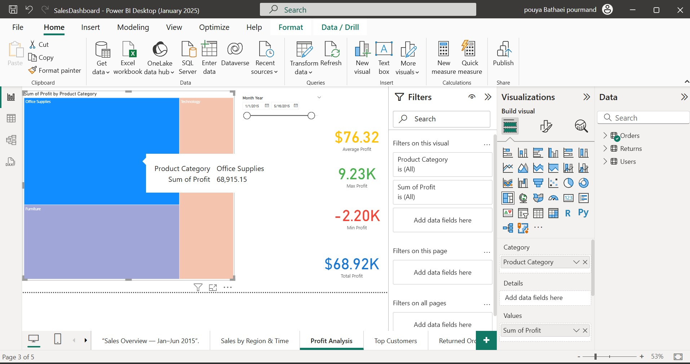
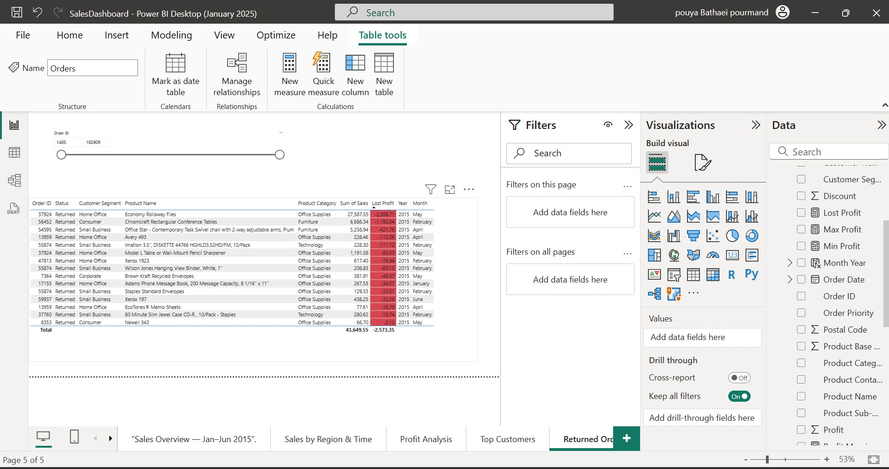
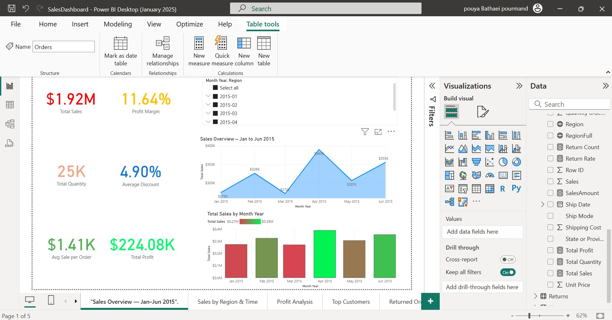
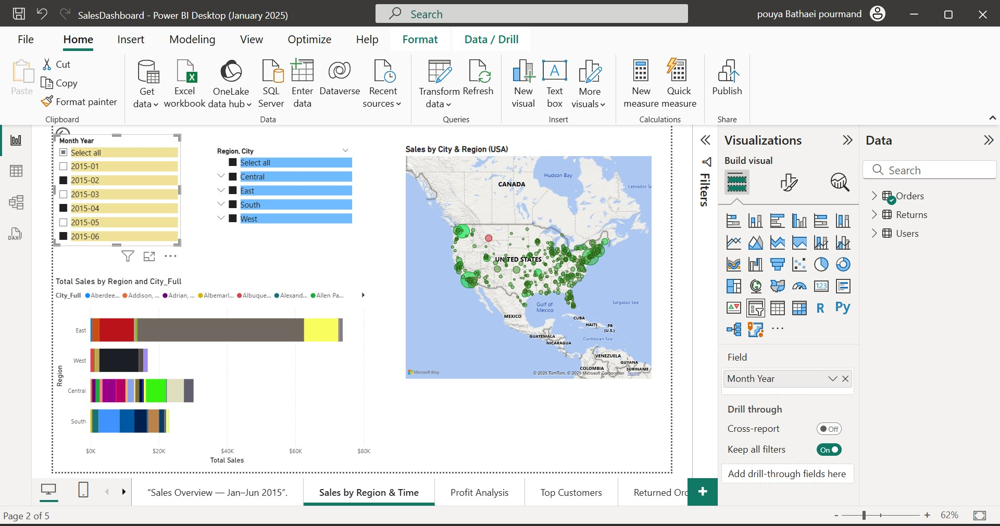
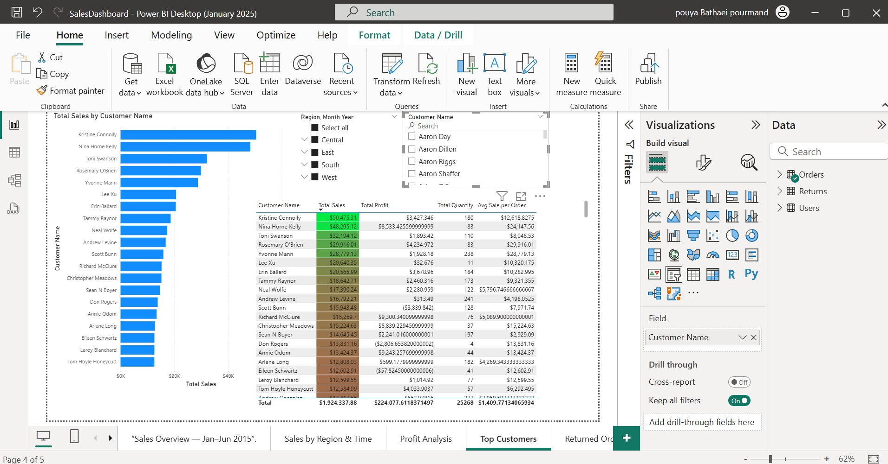

 
# Superstore Sales Analysis 📊

This project is an **end-to-end data analysis** on the famous *Superstore dataset*.  
I used **MySQL**, **Python**, and **Power BI** to clean, process, and visualize sales data, and then built interactive dashboards to uncover business insights.  

---

## 🚀 Tools & Technologies
- **MySQL (Workbench)** – Writing queries and preparing datasets  
- **Python (Pandas, SQLAlchemy, Pathlib, OS)** – Data extraction, transformation, and automation  
- **Power BI** – Building dashboards and visualizations  

---

## 📌 Key Challenges & Solutions
- **Challenge:** Large and inconsistent raw data from Superstore  
  - **Solution:** Used SQL queries and Python scripts to clean and preprocess  
- **Challenge:** Understanding complex sales relationships  
  - **Solution:** Built interactive dashboards in Power BI for clarity and exploration  

---

## 📊 Dashboards (Power BI Screenshots)

Here are some of the main dashboards created in Power BI:

  
  
  
  
  

---

## 📂 Project Structure

superstore_analyse/
│
├── data/                 # Dataset (CSV/Excel)
├── sql/                  # MySQL queries
├── scripts/              # Python scripts for data processing
├── Screenshots/          # Power BI dashboard screenshots
└── README.md             # Project documentation

---

## 📈 Insights
- Identified **top-performing regions and customers**  
- Highlighted **returned orders trend** to improve operations  
- Analyzed **profitability across categories and segments**  
- Provided **clear dashboards** to support data-driven decisions  

---

## 💡 How to Use
1. Clone this repository  
2. Open `SQL/` folder to check queries  
3. Run Python scripts in `Python/` for data preparation  
4. Check `Screenshots/` to explore dashboards  

---

## 🔗 Future Improvements
- Automate dashboard refresh with Power BI service  
- Add predictive analysis (forecasting sales using ML models)  
- Build interactive web-based dashboards with Streamlit  

---

✍️ **Author**: Pouya Bathaie Pourmand  
📅 **Year**: 2025  

